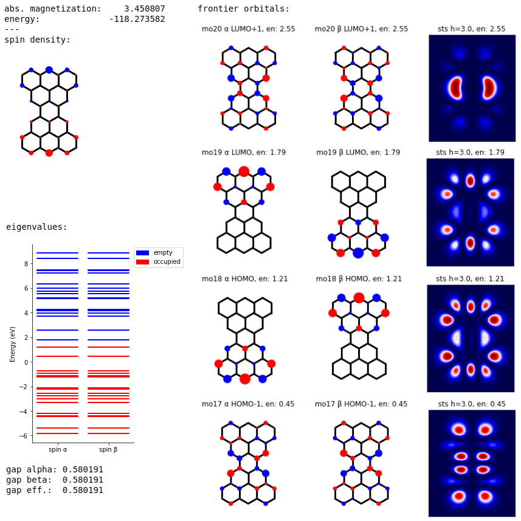

[](https://badge.fury.io/py/tb-mean-field-hubbard)
[](https://zenodo.org/badge/latestdoi/314531046)

# tb-mean-field-hubbard 

Python library to perform tight-binding mean field Hubbard calculations on the conjugated π-networks of organic systems.
Only carbon atoms are supported and each atom is modelled by a single p<sub>z</sub> orbital hosting a single electron.

The modelled Hamiltonian is the following:

+U\sum\limits_{i,\sigma}\langle{\hat{n}_{i,\sigma}}\rangle%20\hat{n}_{i,\overline{\sigma}}-U\sum\limits_{i}\langle{\hat{n}_{i,\uparrow}}\rangle\langle{\hat{n}_{i,\downarrow}}\rangle,})

where c<sup>†</sup>, c and n are respectively the creation, annihiliation and number operators, t is the hopping integral and U denotes the on-site Coulomb repulsion.

### System requirements

Python 3 (tested with 3.6 - 3.9) environment is required with the following libraries (parenthesis indicate tested versions; but the library should work with all recent versions):
* Standard python libraries: `numpy` (1.17.2), `scipy` (1.3.1), `matplotlib` (3.2.1)
* Atomistic simulation environment: `ase` (3.18.1)
* Python Tight Binding: `pythtb` (1.7.2)

Note: the dependencies will be automatically installed via `pip`.

### Installation

Option 1) Install the library and dependencies hosted on PyPI:

```
pip install tb-mean-field-hubbard
```

Option 2) Manual installation, such that you have direct access to the code and the notebook:

```
git clone https://github.com/eimrek/tb-mean-field-hubbard.git
cd tb-mean-field-hubbard
pip install -e .
```

On a normal desktop computer, installation of the python dependencies can take some minutes, while the `tb-mean-field-hubbard` should install in seconds.

### Example usage

Example jupyter notebook `example.ipynb` is provided that performs the calculation for the Clar's goblet molecule. The geometry is read from a `xyz` file. The whole notebook should run in a matter of seconds on a normal desktop computer.
The following image demonstrates a selection of the output for the calculation for parameters `t=2.7` and `U=3.0` (both in electronvolts).

<p align="center"></p>

In addition to the structure of Clar's goblet, the `geom/` folder contains input geometries for triangulene, 4- and 5-rhombene, and several other systems. 
